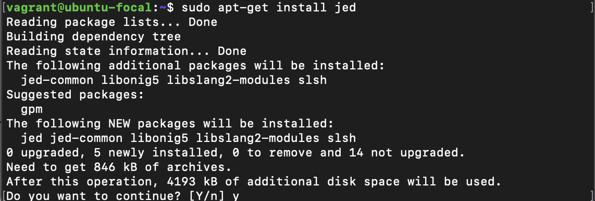
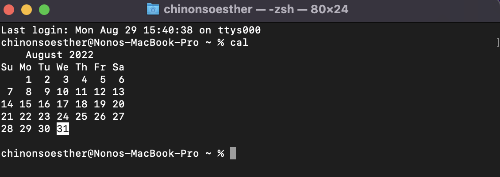
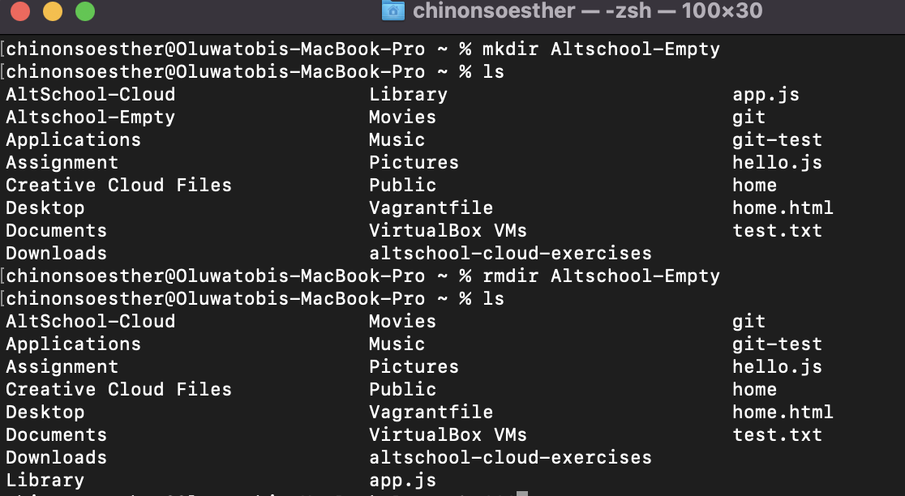
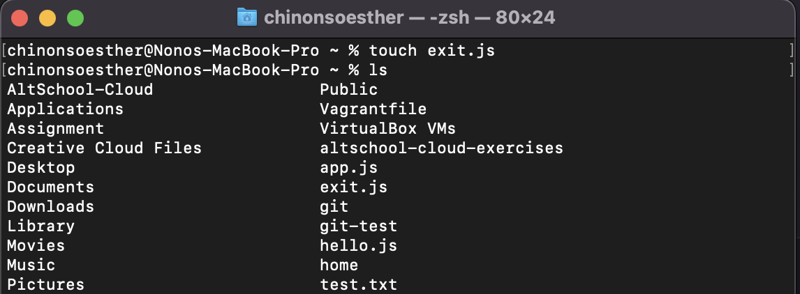

1. apt
   
    The tool apt, annotation processing tool, includes a set of new reflective APIs and supporting infrastructure to process program
    annotations. 

    `sudo apt-get install jed`

    

2. cal

    The cal utility displays a simple calendar in traditional format and ncal offers an alternative layout, more options and the date of Easter. 

    `cal`

    

3. df- display free disk space

    The df utility displays statistics about the amount of free disk space on the specified filesystem or on the filesystem of which file is a part.

    `df -m`

    

4. locate

    The locate program searches a database for all pathnames which match the specified pattern. 

    `locate -b Vagrant`

    

5. mv- move files

    In its first form, the mv utility renames the file named by the source operand to the destination path named by the target operand.

    `mv exam.txt tests.txt`

    

6.  ps- process status

    The ps utility displays a header line, followed by lines containing
     information about all of your processes that have controlling terminals.

     `ps`

     

 7. rm
    
    The rm utility attempts to remove the non-directory type files specified on the command line. 

    `rm altschool-cloud`

    

8. sort

    The sort utility sorts text and binary files by lines.  A line is a record separated from the subsequent record by a newline (default) or NUL ´\0´ character (-z option). 

    `sort hello.js`

    

9. sudo

    sudo allows a permitted user to execute a command as the superuser or another user, as specified by the security policy.

    `sudo passwd`

    

10. touch
    
    The touch utility sets the modification and access times of files.  If any file does not exist, it is created with default permissions.

    `touch`

    
    

    

